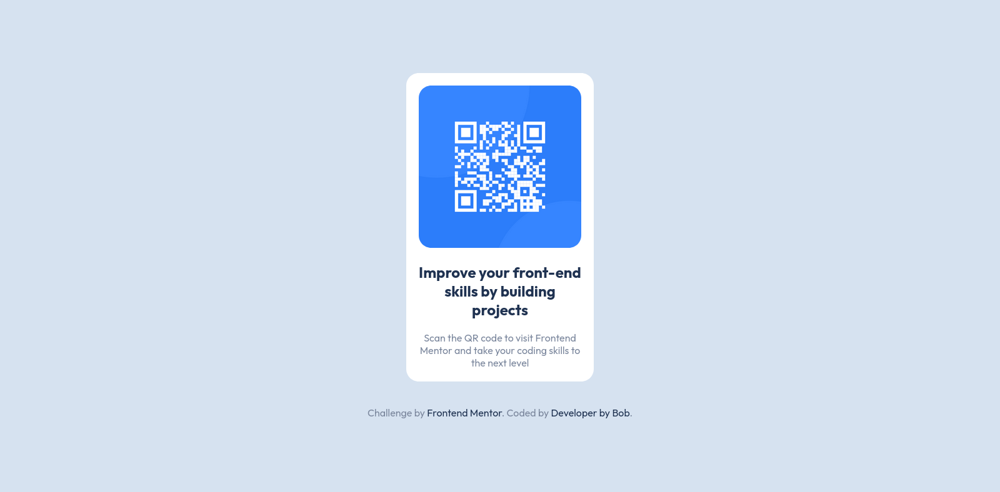
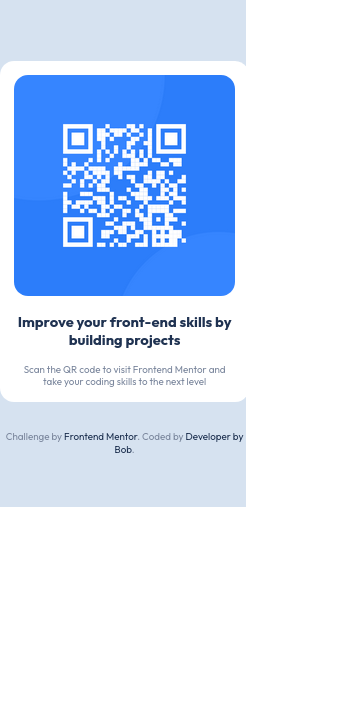

Projeto do Componente de QR Code
==================================

Este projeto é uma solução para o desafio "Componente de QR code" do Frontend Mentor. Ele tem como objetivo melhorar as habilidades de front-end construindo projetos.

Visão Geral
-----------

### O Desafio

O desafio consistia em construir um componente de QR code de acordo com o design fornecido, garantindo que ele se pareça o mais próximo possível do design e seja responsivo em diferentes dispositivos.

### Captura de Tela

Você também pode ver a versão ao vivo [aqui](https://your-live-demo-link.com/).

Recursos
--------

-   Exibe uma imagem de QR code.
-   Fornece informações sobre o propósito do QR code.
-   Design responsivo para vários tamanhos de tela.

Tecnologias
-----------

-   HTML
-   CSS

Configuração
------------

Para executar este projeto, basta fazer o download ou cloná-lo para sua máquina local e abrir o arquivo `index.html` no seu navegador.

bash

`git clone https://github.com/your-username/qr-code-component.git`

Uso
---

Depois de configurar o projeto na sua máquina local, abra o arquivo `index.html` no seu navegador preferido. Você deve ver o componente de QR code exibido juntamente com informações sobre o seu propósito.

Créditos
--------

-   Desafio por Frontend Mentor.
-   Codificado por [Developer by Bob](https://www.frontendmentor.io/profile/devcabessa).